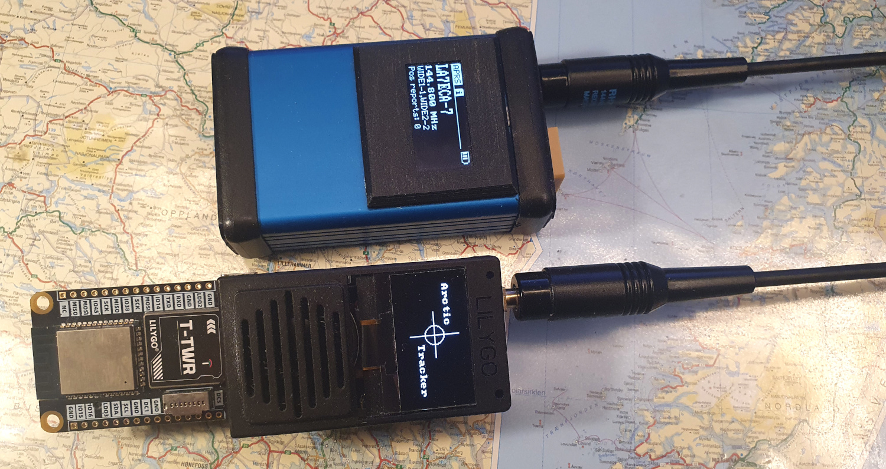

# ArcticTracker-ESP32

Arctic Tracker (v.3) is an APRS tracker platform based on the ESP32S3 MCU module, a GPS, a display and a 
VHF transceiver module. Hardware prototypes were created mainly as experimental prototypes to show how we can build a 
tracker using affordable modules. The Arctic Tracker is also a IoT device capable of using WIFI and the internet when this 
is available: For easy configuration, for pushing APRS data, etc. It can also function as a igate. 

It is based on the earlier Arctic Tracker (v.2) prototype which used an ESP32. This was again based on the even earlier 
Arctic Tracker (v.1) prototype which used a Teensy 3 MCU module and a ESP-8266 module (with NodeMCU). 

See http://www.hamlabs.no for some blogging about this project. *Sorry, hamlabs is down for maintenance at the moment; I hope that it will be up again soon.* 

## Supported hardware

* [_LilyGo T-TWR-plus 2.0_](https://www.lilygo.cc/products/t-twr-plus?variant=42911934185653).
* [_LilyGo T-TWR-plus 2.1_](https://lilygo.cc/products/t-twr-rev2-1).
* Arctic Tracker 4
* Arctic Tracker 4 UHF (LoRa APRS)

## Implemented features

This is the firmware. It is implemented in C and based on the ESP-IDF which again is based on FreeRTOS. 
It is fairly complete now. The following features are implemented:

* Command shell running on a serial port (USB). This allows settings of various parameters, using persistent storage (flash).
* Internetworking using WIFI. Automatically connect to access points available. User can set up 
  an ordered list of APs to try. It can also function as its own access point.
* Webserver/REST API.
* Interface with GPS for position and time. 
* OLED display, status screens and menu. Use button to operate.
* Sending APRS packets. Tracking, smart beaconing.
* Receiving APRS packets. 
* Add highly compressed earlier position reports to packets. This can improve trails significantly.
  See [how this is done here](http://hamlabs.no/2020/11/02/improving-trails-with-arctic-tracker/). 
* Digipeater and igate. 
* Basic information on battery and charging.
* Track logging. Store positions in flash memory e.g. every 5 seconds and upload to a REST
  API on a Polaric Server when network is available. '
* Firmware upgrades over the air (OTA) is still "work in progress"..

## REST API and security
A REST API is provided for external apps (typically). It mainly has methods for reading and updating settings. A strong authentication scheme based on SHA256 HMAC is used. A web-browser-based client is under development and the tracker support CORS to allow clients have origins other than the tracker itself. The tracker supports mDNS which allows discovering trackers (or at least finding their IP addresses) that are on the same LAN. This is still somewhat work-in-progress...

A [web-client is here](https://github.com/Hamlabs/ArcticTracker-Webapp): This is also contained in the tracker itself to allow configuration using the softAP mode. A smartphone app is under way. 

The webserver uses HTTPS (SSL/TLS). In the current version, a self-signed certificate is embedded in the firmware. This means that you will need to accept an exception for this certificate in the browser the first time you access the tracker. Also, if the private key is embedded into published firmware code, it can (for skilled hackers) be exposed. This doesn't affect the authentication scheme though. For stronger security consider building your firmware yourself and be sure to create a new certificate. A certificate signed by a CA could be used. 

## Building the firmware
It can be built with *esp-idf* (version 5.0.x) and the *idf.py* tool. Follow the instructions to install the *esp-idf* and run the necessary scripts there first to set it up. Download the *Arctic Tracker* repository in another directory. cd to this directory and run the following commands to add external components.: 
  ```
  idf.py add-dependency "espressif/mdns^1.2.4" 
  idf.py add-dependency "espressif/led_strip^2.5.3" 
  ```
The *led_strip* component is for the LilyGo T-TWR plus (neopixel LED). For this device you will also need to download *XPowersLib* and edit the EXTRA_COMPONENT_DIRS setting in CMakeLists.txt (in the top level directory) to the location where you installed it.

It is a good idea to generate a new SSL certificate now and then. You could also just cd to the directory and run the command inside the gencert.sh script. You should have openssl installed on your computer to do this. 
  ```
  cd components/networking/cert; sh gencert.sh
  ```
You may start menuconfig and go to the *Arctic Tracker Config* and check if the right target device is selected. More settings are in *main/defines.h*.
  ```
  idf.py menuconfig
  ```
  
To build the firmware, run
  ```
  idf.py build
  ```
This will build everything. You may flash the firmware directly from idf.py this way. Note that this writes everything to the flash: Including the partition table, a bootloader and the webapp. 
  ```
  idf.py flash
  ```

## Flashing a binary
We intend to post pre-compiled binaries with each release and are also available [here](https://arctictracker.no/download/). The complicating factor is that there are more than one way to do it and that the firmware consists of multiple parts: The bootloader, the partition table, the webapp, etc.. The most flexible option is probably to use *esptool* or a similar program, but you will need to know some technical details. It is also possible to convert the binary to the UF2 format using *uf2conv* and use a uf2 bootloader.

Download the proper *ArcticTracker_xx.zip* file and unpack it in a directory. Go to that directory and use *esptool* or a similar tool (on Windows, we may use the [*flash download tool*](https://www.espressif.com/en/support/download/other-tools) from Expressif). The *flash_all.sh* script shows how to use *esptool*. The same parameters can be used in the Windows *flash download tool*. On a Linux system you may just run the *flash_all.sh* script to flash everything. 

You may choose to update only the app (ArcticTracker.bin) or the Webapp (webapp.bin) if you want and if the other parts are in place. Use the the addresses provided. 


## Setup of the tracker - the command shell
Plug a USB cable into the tracker and your computer. A serial interface will appear. Start a (serial) terminal program and connect to the serial interface (on Linux it is /dev/ttyACM0). Alternatively, the monitor command of the idf.py may be used. It may be necessary to reset the tracker to get the command prompt (cmd:). 

The command-shell let you configure everything and is useful in developing and debugging the software. Be sure to set the *callsign*. The *'help'* command shows the available commands. The *'tracker on'* command turns on the tracking (on by default). *'radio on'* command turns on the radio (on by default). The *'wifi on'* command turns on the WIFI. The *'ap'* command lets you set up a list of WIFI access points. The tracker will try to connect to these in order if they are in range. Also, for access from the webapp, the *'api-key'* can be used to change a secret key to be used for the webapp to authenticate. If things are working as expected, you should to be able to get to the most important settings with a web-browser. 

The tracker is also able to function as its own access point (menu or *'softap'* command). Info about ip-address, etc. is shown on the display so you can connect your browser to it. The password can be set using the command shell or the web-app. 

The api-key and the softap key is '123456789' by default. Please change it at your first convenience.

## Issues and work in progress
When working with a version 4 tracker we have also moved on to exploring LoRa APRS (and possibly FSK modes) on 70 cm.  In Norway it is now legal to use up to 200 Khz bandwith from 433.600 to 434 MHz, so an Arctic Tracker 4 UHF PCB (with a LoRa module) is being tested. A version 4 for VHF/plain old APRS is also being tested and it looks promising. I hope to publish some on this soon. 

Receiving packets is more complicated than transmitting and involve some DSP work and sampling from the ADC. This seems to work reasonably well, though it still somewhat work-in-progress. It can work without the squelch signal now. At least in my setup it seems the SA-868 need a rather strong signal to open the squelch even at the lowest setting (it may be better outside my shack where there is less computer noise).

The SA868 comes with a programmable version and I wonder if it could used and maybe optimized a bit for APRS? 

I am open for ideas and contributions :)
 

